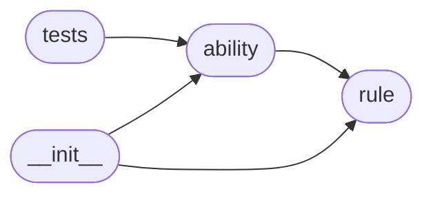

# Code Overview

[_Documentation generated by Documatic_](https://www.documatic.com)

<!---Documatic-section-Codebase Structure Python-start--->
## Codebase Structure Python

The codebase has a flat structure, with 4 code files.

<!---Documatic-block-system_architecture-start--->

<!---Documatic-block-system_architecture-end--->

# #
<!---Documatic-section-Codebase Structure Python-end--->

<!---Documatic-section-Key Objects-start--->
## Key Objects

There are exposed imports at level-0
from the source directory (cancan)

<!---Documatic-block-canca-start--->

	
<code>canca</code> (Click to Expand!)

* `cancan.ability.Ability`
* `cancan.rule.Rule`

<!---Documatic-block-canca-end--->

# #
<!---Documatic-section-Key Objects-end--->

<!---Documatic-section-Important Functions-start--->
## Important Functions

<!---Documatic-block-important_funcs-start--->
<!---Documatic-block-end_user_funcs-start--->
### End User Exposed Functions

* cancan.rule.Rule
* cancan.ability.Ability
<!---Documatic-block-end_user_funcs-end--->
<!---Documatic-block-important_funcs-end--->

# #
<!---Documatic-section-Important Functions-end--->

<!---Documatic-section-Class Hierarchy-start--->
## Class Hierarchy

<!---Documatic-block-object-start--->

	
<code>object</code> (Click to Expand!)

* cancan.ability.Ability
* cancan.rule.Rule

<!---Documatic-block-object-end--->

<!---Documatic-block-unittest.TestCase-start--->

	
<code>unittest.TestCase</code> (Click to Expand!)

* cancan.tests.TestAbility

<!---Documatic-block-unittest.TestCase-end--->

# #
<!---Documatic-section-Class Hierarchy-end--->

[_Documentation generated by Documatic_](https://www.documatic.com)